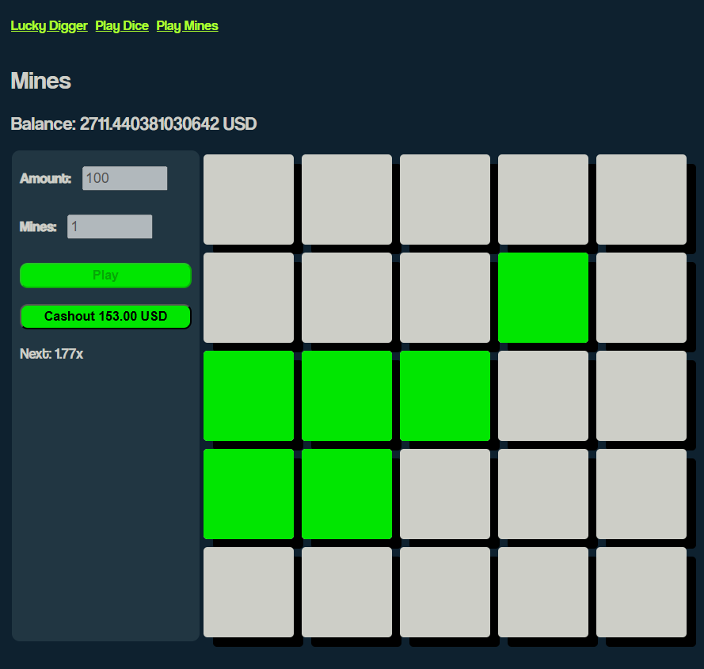
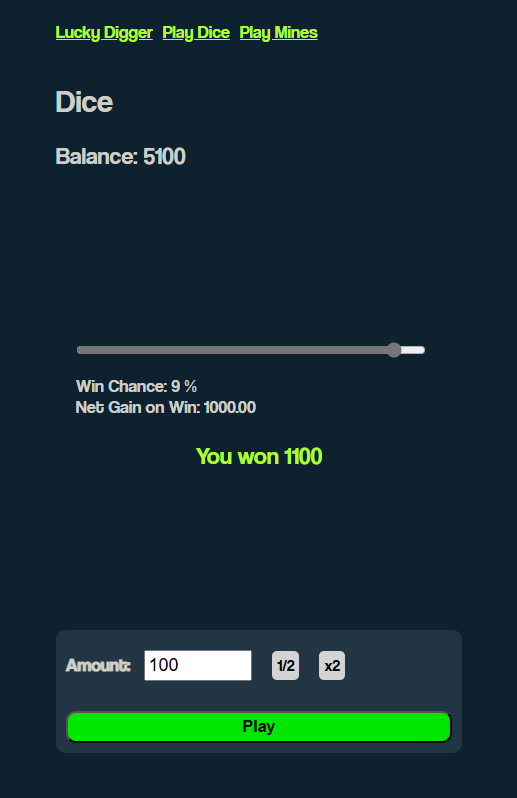

# Lucky Digger

**Lucky Digger** is a web-based clone of Stake's popular dice and mines game. Built with ReactJS and TypeScript, the game offers an engaging and interactive experience, allowing users to test their luck in a thrilling, casino-style environment.

### Key Features
- **Dice Game:** Roll the dice and bet on the outcome. Users can adjust the multiplier and predict higher or lower outcomes to win.
- **Mines Game:** Select tiles on a grid to reveal hidden rewards while avoiding mines. The more tiles revealed without hitting a mine, the greater the rewards.
- **User-Friendly Interface:** A clean, intuitive design ensures a seamless gaming experience.
- **Real-Time Interaction:** Instant feedback on bets and actions, creating a dynamic and engaging user experience.
- **Deployed on Vercel:** Optimized for fast loading times and smooth performance.

### Short Description
Lucky Digger is inspired by Stake's dice and mines games, bringing the excitement of online gambling into a simple, easy-to-use web application. Players can enjoy two classic games where the outcome depends on their choices and a bit of luck. In the Dice Game, users bet on the outcome of a dice roll, choosing whether the result will be higher or lower than their prediction. The Mines Game challenges players to uncover hidden rewards on a grid without hitting any mines, with each safe move increasing the potential payout. The app's interface is designed for clarity and ease of use, making it accessible for both beginners and experienced players.

### Snippets
<h3>Lucky Digger Mines</h3>

<h3>Lucky Digger Dice</h3>

### Tech Used
- **Frontend:** ReactJS, TypeScript
- **Deployment:** Vercel

## How to Use

1. Clone the repository: `git clone https://github.com/sarthakmishraa/lucky-digger.git`

Feel free to clone the repository and explore the project. Contributions are welcome!

## Contributing
Contributions are welcome! Please fork the repository and submit a pull request.